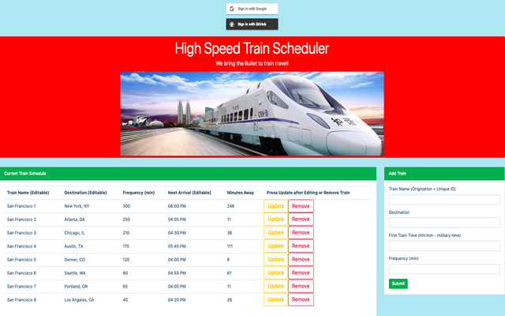

# Live Link to [Train Scheduler](https://jkawahara.github.io/train-scheduler/)
### 1. Why/Background
  * Train Scheduler is a web app that enable users to view and manage train schedules
### 2. What / Objectives / User Stories
  * This homework covers the following aspects of web development on the client side, using a realtime database, jQuery, Moment.js, Bootstrap, to build a train scheduling web-based application. 
  * From design through deployment of the application, this project used the following web development technologies:
    * Server-side: Firebase Realtime Database for data persistence
    * Client-side: Bootstrap framework for HTML/CSS/JS
  * User Stories, by categorization:
    * Design and develop Firebase configuration, including authentication using open authorization providers
    * Design and develop View
      * User Story 1- When adding trains, administrators should be able to submit the following: Train Name, Destination, First Train Time -- in military time, Frequency -- in minutes
      * User Story 2- Calculate when the next train will arrive; this should be relative to the current time
      * User Story 3- Users from many different machines must be able to view same train times
      * User Story 4- Update your "minutes to arrival" and "next train time" text once every minute
      * User Story 5- Add update and remove buttons for each train. User can edit the row's elements (train's Name, Destination and Arrival Time) then, by relation, minutes to arrival
        * As clarification, if Arrival Time is changed, the Next Arrival will show the Arrival Time until train arrives. As soon as train arrives, the Next Arrival Time will return to original calculation use First Train Time
### 3. How / Design Description
  * Although scope of the project fits well into [Agile methodology with Scrum and Kanban frameworks](https://en.wikipedia.org/wiki/Agile_software_development), due to limited scope and non-group assignment, GitHub's built-in tools were not used to support project execution:
    * Projects: Kanban board for documenting user stories and overall progress
    * Issues: Issue tracking for user stories, features and bug report
  * Prerequisites for Development:
    * MacBook Air (Intel Core i7, 2.2 GHz, 1 Processor, 2 Cores, 8GB)
    * git version 2.18.0
    * Visual Studio Code Version 1.29.1
    * [GitHub Repo](https://github.com/jkawahara/train-scheduler)
    * Chrome Version 70.0.3538.102 (Official Build) (64-bit)
  * Built With:
    * Client-side:
      * HTML/CSS/JS
      * [Bootstrap](https://getbootstrap.com/docs/4.1/getting-started/introduction/)
      * [jQuery](https://cdnjs.cloudflare.com/ajax/libs/jquery/3.2.1/jquery.min.js)
      * [Moment.js](https://cdn.jsdelivr.net/momentjs/2.12.0/moment.min.js)
    * Server-side
      * [Firebase](https://www.gstatic.com/firebasejs/5.5.9/firebase.js)
  * Installing:
    * For further development or use of this application, clone or download application files from GitHub, which is organized into the following directory structure:
      * /train-scheduler
        * /assets
          * /css
          * /images
          * /javascript
        * .gitignore
        * index.html
        * LICENSE
        * README.md
  * Running the tests:
    * Unit testing was informally executed
  * Deployment:
    * App deployed on [GitHub pages](https://jkawahara.github.io/train-scheduler/)

 ## Versioning
  * For the versions available, see the tags on this repository.
 ## Authors
  * John Kawahara.
  * N/A- See also the list of contributors who participated in this project.
 ## License
  * This project is licensed under the [MIT License](LICENSE).
 ## Acknowledgments
  * Thanks to David Hallinan, Hannah Bowers and Glo Austin for their guidance and support.